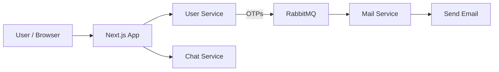
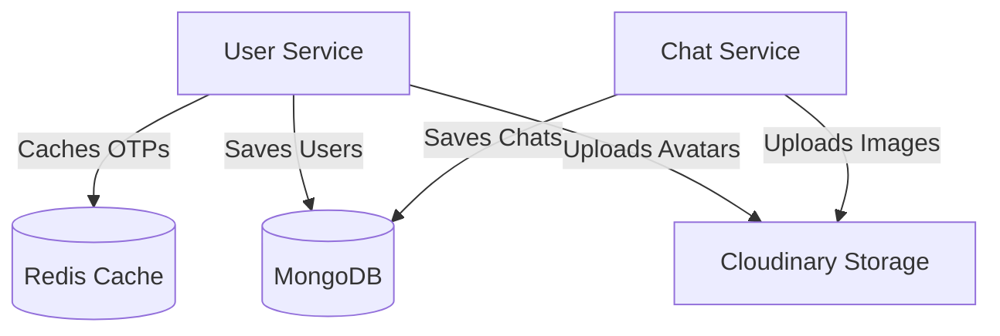
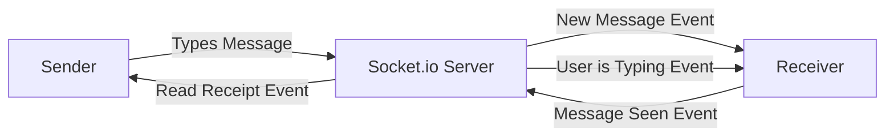
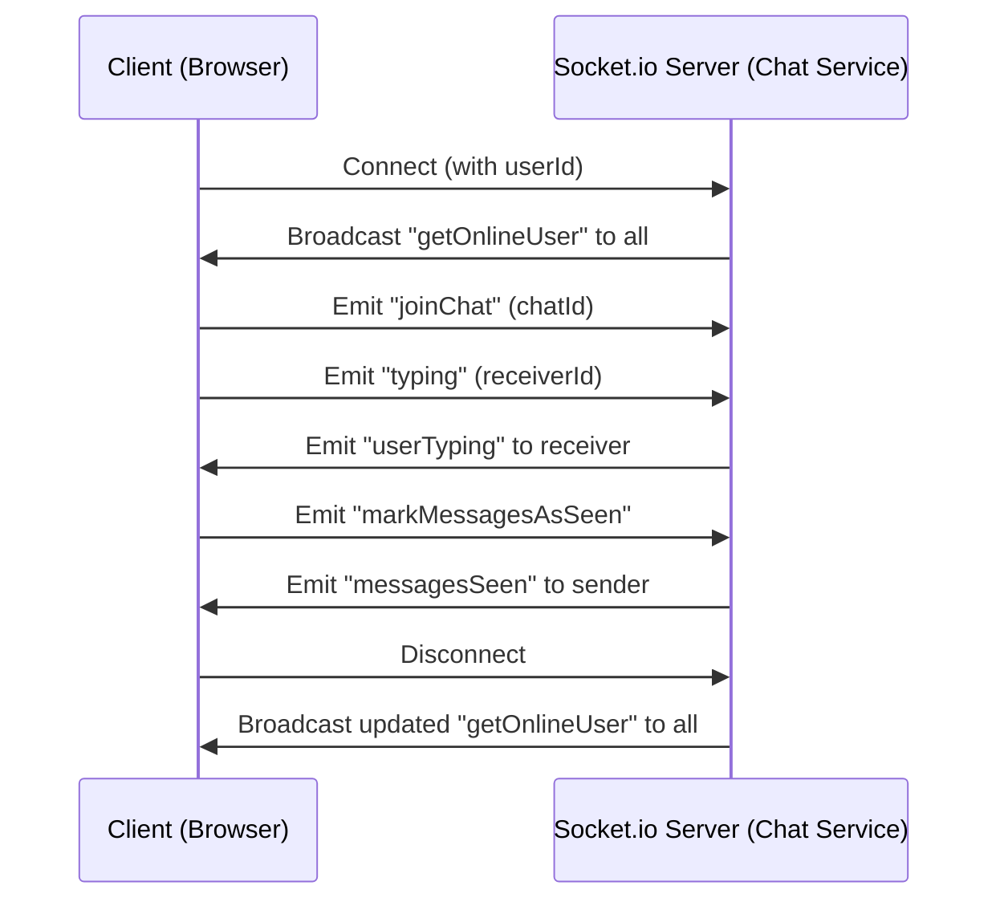

# Chatex — Real-Time Microservices Chat Application

A scalable, real-time chat platform built with a microservices architecture. The backend is split into three independent services — **User**, **Chat**, and **Mail** — that communicate asynchronously through RabbitMQ message queues. The frontend is a Next.js application that connects via REST APIs and WebSockets.

---

## Project Highlights

- **Microservices Architecture** — Three independent backend services (`user`, `chat`, `mail`), each with its own Express server, database connection, and responsibility boundary. No monolith, no tight coupling.
- **Passwordless Authentication** — Users log in with just their email. An OTP is generated, stored in Redis (with a 5-minute TTL and 60-second rate limiting), and delivered asynchronously via RabbitMQ to the Mail service. Rate limiting prevents abuse (one OTP per email per 60 seconds).
- **Asynchronous Inter-Service Communication** — RabbitMQ handles two message queues: `send-otp` (User → Mail) and `profile-updates` (User → Chat). Services never call each other's HTTP endpoints for background work.
- **Real-Time WebSockets** — Socket.io powers instant message delivery, typing indicators, online presence tracking, and live "message seen" status updates.
- **Cloud-Based Media Storage** — Both profile pictures and chat images are uploaded directly to Cloudinary via Multer middleware. Profile pics are auto-cropped to 500×500 squares; chat images are capped at 800×600.
- **Smart Image Processing (Hidden Feature)** — Profile pictures are automatically cropped and focused to create a perfect square, ensuring consistent UI across the application without requiring users to manually crop images.
- **Graceful Fallbacks (Hidden Feature)** — If the Chat service fails to fetch a user's profile from the User service, it gracefully falls back to displaying "Unknown User" instead of crashing the entire chat interface.
- **Dark/Light Mode** — Full system-aware theme support via `next-themes`.
- **Message Read Receipts** — Messages track `seen` and `seenAt` fields. When a user opens a chat, all unread messages from the other participant are marked as seen, and the sender is notified in real-time via Socket.io.

---

## Core Features

- **Real-Time Messaging** — Instant message delivery via WebSockets without page refreshes. Supports both text and image messages.
- **OTP-Based Login** — No passwords. Enter your email, receive a 6-digit OTP, verify it, and you are in.
- **Profile Management** — Update your display name and upload a profile picture. Profile picture changes are broadcast to all connected clients in real-time through RabbitMQ.
- **Image Sharing in Chat** — Send images directly in conversations. Images are uploaded to Cloudinary and delivered to the receiver instantly.
- **Typing Indicators** — See when the other person is typing in real-time.
- **Online/Offline Presence** — A live list of currently online users, updated the moment someone connects or disconnects.
- **Unseen Message Count** — The sidebar shows how many unread messages you have per conversation.
- **Chat Sidebar with Latest Message Preview** — Conversations are sorted by most recent activity, with a preview of the last message.
- **Duplicate Chat Prevention** — The backend strictly ensures that only one unique 1-on-1 chat room can exist between any two specific users.
- **Persistent Sessions** — JWT authentication tokens are configured with a 15-day expiry, keeping users seamlessly logged in without constant re-authentication.

---

## Video Demonstration

*The video below provides a comprehensive walkthrough of Chatex in action. It demonstrates the complete process of setting up and running the application on a local machine, and explores all the core features including passwordless OTP authentication, real-time messaging, profile picture cropping, and live read receipts.*

https://github.com/user-attachments/assets/f65d6b0e-c64b-4cb6-95f0-1324ab334058

---

## Tech Stack

| Technology | Purpose |
|---|---|
| Next.js 15 / React 19 | Frontend framework with server-side rendering |
| Node.js / Express 5 | Backend runtime and HTTP framework |
| TypeScript | Type safety across the full stack |
| MongoDB / Mongoose | Primary database for users, chats, and messages |
| Redis | OTP storage, rate limiting, and session caching |
| RabbitMQ | Asynchronous message queue between microservices |
| Socket.io | Real-time bidirectional communication |
| Cloudinary | Cloud-based image storage and transformation |
| Multer | Multipart file upload handling |
| Nodemailer | SMTP-based email delivery for OTPs |
| Tailwind CSS | Utility-first CSS framework |
| JWT | Stateless authentication tokens (15-day expiry) |

---

## Architecture Diagrams

### 1. System Overview



### 2. Data Storage Flow



### 3. Real-Time Chat Engine



### 4. WebSocket Event Lifecycle



---

## Project Structure

```
chat code/
├── backend/
│   ├── user/                          # User microservice
│   │   ├── src/
│   │   │   ├── config/
│   │   │   │   ├── TryCatch.ts
│   │   │   │   ├── cloudinary.ts
│   │   │   │   ├── db.ts
│   │   │   │   ├── generateToken.ts
│   │   │   │   └── rabbitmq.ts
│   │   │   ├── controllers/
│   │   │   │   └── user.ts
│   │   │   ├── middleware/
│   │   │   │   ├── isAuth.ts
│   │   │   │   └── multer.ts
│   │   │   ├── model/
│   │   │   │   └── User.ts
│   │   │   ├── routes/
│   │   │   │   └── user.ts
│   │   │   └── index.ts
│   │   ├── .env
│   │   ├── package.json
│   │   └── tsconfig.json
│   │
│   ├── chat/                          # Chat microservice
│   │   ├── src/
│   │   │   ├── config/
│   │   │   │   ├── TryCatch.ts
│   │   │   │   ├── cloudinary.ts
│   │   │   │   └── db.ts
│   │   │   ├── controllers/
│   │   │   │   └── chat.ts
│   │   │   ├── middlewares/
│   │   │   │   ├── isAuth.ts
│   │   │   │   └── multer.ts
│   │   │   ├── models/
│   │   │   │   ├── Chat.ts
│   │   │   │   └── Messages.ts
│   │   │   ├── routes/
│   │   │   │   └── chat.ts
│   │   │   ├── socket/
│   │   │   │   └── socket.ts
│   │   │   ├── consumer.ts
│   │   │   ├── declarations.d.ts
│   │   │   └── index.ts
│   │   ├── .env
│   │   ├── package.json
│   │   └── tsconfig.json
│   │
│   └── mail/                          # Mail microservice
│       ├── src/
│       │   ├── consumer.ts
│       │   └── index.ts
│       ├── .env
│       ├── package.json
│       └── tsconfig.json
│
├── frontend/                          # Next.js frontend
│   ├── src/
│   │   ├── app/
│   │   │   ├── chat/
│   │   │   │   └── page.tsx
│   │   │   ├── login/
│   │   │   │   └── page.tsx
│   │   │   ├── profile/
│   │   │   │   └── page.tsx
│   │   │   ├── verify/
│   │   │   │   └── page.tsx
│   │   │   ├── globals.css
│   │   │   ├── layout.tsx
│   │   │   └── page.tsx
│   │   ├── components/
│   │   │   ├── ChatHeader.tsx
│   │   │   ├── ChatMessages.tsx
│   │   │   ├── ChatSidebar.tsx
│   │   │   ├── Loading.tsx
│   │   │   ├── MessageInput.tsx
│   │   │   ├── ThemeProvider.tsx
│   │   │   └── VerifyOtp.tsx
│   │   └── context/
│   │       ├── AppContext.tsx
│   │       └── SocketContext.tsx
│   ├── public/
│   ├── .gitignore
│   ├── global.d.ts
│   ├── next.config.ts
│   ├── package.json
│   ├── postcss.config.mjs
│   └── tsconfig.json
│
├── rabbitmq and aws guide_compressed.pdf
└── README.md
```

---

## File Reference Tables

### User Service (`backend/user/src/`)

| File | Description |
|---|---|
| `index.ts` | Entry point. Initializes Express, connects to MongoDB, Redis, and RabbitMQ. Mounts user routes on `/api/v1`. |
| `config/db.ts` | Connects to MongoDB using the `MONGO_URI` env variable. Database name: `Chatappmicroserviceapp`. |
| `config/cloudinary.ts` | Configures Cloudinary SDK with cloud name, API key, and API secret from environment variables. |
| `config/generateToken.ts` | Signs a JWT containing the full user object. Tokens expire after 15 days. |
| `config/rabbitmq.ts` | Establishes a persistent RabbitMQ connection and exposes a `publishToQueue()` function for publishing messages to any named queue. |
| `config/TryCatch.ts` | Higher-order function that wraps Express route handlers in try/catch blocks and returns 500 on unhandled errors. |
| `controllers/user.ts` | Contains all user-related logic: `loginUser` (generates OTP → publishes to `send-otp` queue), `verifyUser` (validates OTP from Redis → creates user if new → returns JWT), `myProfile`, `updateName`, `getAllUsers`, `getAUser`, `updateProfilePic` (uploads to Cloudinary → publishes to `profile-updates` queue). |
| `middleware/isAuth.ts` | JWT authentication middleware. Extracts token from `Authorization: Bearer <token>` header, verifies it, and attaches the decoded user to `req.user`. |
| `middleware/multer.ts` | Configures Multer with Cloudinary storage for profile picture uploads. Stores in `profile-pics` folder, auto-crops to 500×500, limits to 5MB image files only. |
| `model/User.ts` | Mongoose schema for the User model. Fields: `name`, `email` (unique), `profilePic` (url + publicId). Includes timestamps. |
| `routes/user.ts` | Defines all user API routes: `POST /login`, `POST /verify`, `GET /me`, `GET /user/all`, `GET /user/:id`, `POST /update/user`, `POST /update/profile-pic`. |

### Chat Service (`backend/chat/src/`)

| File | Description |
|---|---|
| `index.ts` | Entry point. Connects to MongoDB, starts the RabbitMQ profile-update consumer, mounts chat routes, and starts the HTTP + WebSocket server. |
| `config/db.ts` | Connects to MongoDB (same database: `Chatappmicroserviceapp`). |
| `config/cloudinary.ts` | Configures Cloudinary SDK for chat image uploads. |
| `config/TryCatch.ts` | Same try/catch wrapper as the User service. |
| `controllers/chat.ts` | Core chat logic: `createNewChat` (creates a 1-on-1 chat between two users, prevents duplicates), `getAllChats` (returns all chats for the logged-in user with the other participant's profile and unseen message count), `sendMessage` (saves text/image message, updates `latestMessage`, emits to receiver via Socket.io), `getMessagesByChat` (fetches all messages, marks unseen ones as read, emits `messagesSeen` to sender). |
| `middlewares/isAuth.ts` | JWT authentication middleware (same logic as User service, uses shared `JWT_SECRET`). |
| `middlewares/multer.ts` | Configures Multer with Cloudinary storage for chat images. Stores in `chat-images` folder, limits to 800×600, 5MB max. |
| `models/Chat.ts` | Mongoose schema for Chat. Fields: `users` (array of two user IDs), `latestMessage` (text + sender). Includes timestamps. |
| `models/Messages.ts` | Mongoose schema for Messages. Fields: `chatId` (ref to Chat), `sender`, `text`, `image` (url + publicId), `messageType` (text or image), `seen`, `seenAt`. Includes timestamps. |
| `routes/chat.ts` | Chat API routes: `POST /chat/new`, `GET /chat/all`, `POST /message` (with image upload), `GET /message/:chatId`. |
| `socket/socket.ts` | Socket.io server setup. Handles: `connection` (registers user in online map), `joinChat`/`leaveChat` (room management), `typing`/`stopTyping` (typing indicators), `markMessagesAsSeen` (bulk-marks messages and notifies sender), `disconnect` (removes from online map). Broadcasts `getOnlineUser` on every connect/disconnect. |
| `consumer.ts` | RabbitMQ consumer that listens on the `profile-updates` queue. When a user updates their profile picture in the User service, this consumer receives the event and broadcasts it to all connected clients via Socket.io (`userProfileUpdated` event). |
| `declarations.d.ts` | TypeScript module declaration for `multer-storage-cloudinary`. |

### Mail Service (`backend/mail/src/`)

| File | Description |
|---|---|
| `index.ts` | Entry point. Loads environment variables, starts the RabbitMQ consumer, and runs a minimal Express server. |
| `consumer.ts` | RabbitMQ consumer that listens on the `send-otp` queue. When a message arrives, it parses the `{to, subject, body}` payload, creates a Nodemailer transport using Gmail SMTP (port 465), sends the email, and acknowledges the message. |

### Frontend (`frontend/src/`)

| File | Description |
|---|---|
| `app/layout.tsx` | Root layout. Wraps the entire app in `ThemeProvider` → `AppProvider` → `SocketProvider`. Sets the page title to "Chatex". |
| `app/page.tsx` | Home page. Immediately redirects to `/chat`. |
| `app/login/page.tsx` | Login page. Email input form that sends a login request to the User service. Redirects to `/verify` on success. |
| `app/verify/page.tsx` | OTP verification page. Renders the `VerifyOtp` component inside a `Suspense` boundary with a loading spinner. |
| `app/chat/page.tsx` | Main chat interface. The primary page users interact with after logging in. Contains the sidebar and active chat view. |
| `app/profile/page.tsx` | Profile management page. Allows users to update their display name and upload a new profile picture. |
| `components/ChatSidebar.tsx` | Sidebar component. Displays the list of conversations sorted by recent activity, shows unseen message counts, latest message previews, online status indicators, and a search/new chat interface. |
| `components/ChatHeader.tsx` | Header bar for the active chat. Shows the other user's name, profile picture, online status, and typing indicator. |
| `components/ChatMessages.tsx` | Message display component. Renders the scrollable message list with text and image messages, timestamps, and read receipts. |
| `components/MessageInput.tsx` | Message input bar. Text input with image attachment support. Emits typing/stopTyping socket events. |
| `components/VerifyOtp.tsx` | OTP input form. Handles the 6-digit OTP submission, verification, and redirect on success. |
| `components/ThemeProvider.tsx` | Thin wrapper around `next-themes` `ThemeProvider` for dark/light mode. |
| `components/Loading.tsx` | Full-screen loading spinner component. |
| `context/AppContext.tsx` | Global application state. Manages user data, authentication status, chat list, and user list. Provides `fetchUser`, `fetchChats`, `fetchUsers`, and `logoutUser` functions. Defines service base URLs (User: port 5000, Chat: port 5002). |
| `context/SocketContext.tsx` | Socket.io connection manager. Establishes a WebSocket connection to the Chat service on login, tracks online users list, and provides the socket instance to all child components. |

---

## How to Start the App

### Prerequisites

Make sure you have the following installed and running:

- **Node.js** (v18 or higher)
- **MongoDB** (local instance or MongoDB Atlas)
- **Redis** (local server or a cloud instance like Redis Cloud)
- **RabbitMQ** (local install, Docker, or a managed service like CloudAMQP)
- **Cloudinary account** (free tier works — you need cloud name, API key, and API secret)
- **Gmail App Password** (for the Mail service to send OTP emails via SMTP)

### Step 1 — Clone the Repository

```bash
git clone <your-repository-url>
cd CHATEX-Chatting_App
```

### Step 2 — Configure Environment Variables

Create `.env` files in each backend service directory:

**`backend/user/.env`**
```env
PORT=5000
MONGO_URI=mongodb://localhost:27017
JWT_SECRET=your_jwt_secret_here
REDIS_URL=redis://localhost:6379
Rabbitmq_Host=localhost
Rabbitmq_Username=guest
Rabbitmq_Password=guest
CLOUDINARY_CLOUD_NAME=your_cloud_name
CLOUDINARY_API_KEY=your_api_key
CLOUDINARY_API_SECRET=your_api_secret
```

**`backend/chat/.env`**
```env
PORT=5002
MONGO_URI=mongodb://localhost:27017
JWT_SECRET=your_jwt_secret_here          # Must match the User service
Rabbitmq_Host=localhost
Rabbitmq_Username=guest
Rabbitmq_Password=guest
USER_SERVICE=http://localhost:5000
CLOUDINARY_CLOUD_NAME=your_cloud_name
CLOUDINARY_API_KEY=your_api_key
CLOUDINARY_API_SECRET=your_api_secret
```

**`backend/mail/.env`**
```env
PORT=5001
Rabbitmq_Host=localhost
Rabbitmq_Username=guest
Rabbitmq_Password=guest
USER=your_gmail_address@gmail.com
PASSWORD=your_gmail_app_password
```

### Step 3 — Install Dependencies and Start Each Service

Open four separate terminal windows:

**Terminal 1 — User Service**
```bash
cd backend/user
npm install
npm run dev
```

**Terminal 2 — Chat Service**
```bash
cd backend/chat
npm install
npm run dev
```

**Terminal 3 — Mail Service**
```bash
cd backend/mail
npm install
npm run dev
```

**Terminal 4 — Frontend**
```bash
cd frontend
npm install
npm run dev
```

### Step 4 — Open the App

Navigate to `http://localhost:3000` in your browser. You will be redirected to the chat page. If you are not logged in, go to `/login` to begin the OTP flow.

---

## Things You Should Know (Crucial for Avoiding Errors)

- **Redis Must Be Running:** The User service relies entirely on Redis for OTP generation and rate limiting. If your local Redis server isn't running, the login process will fail immediately.
- **JWT_SECRET strict matching:** The `JWT_SECRET` must be exactly the same across both the User service and the Chat service. If they don't match, the Chat service will silently reject valid tokens generated by the User service.
- **Environment Variables Need Restarts:** If you change anything in any `.env` file, you must completely stop that terminal process (Ctrl+C) and run `npm run dev` again. The changes won't be picked up automatically.
- **The Chat service calls the User service over HTTP** to fetch user profiles (for displaying names and avatars in chats). The `USER_SERVICE` env variable in the Chat service `.env` must exactly match the URL where the User service is running (e.g., `http://localhost:5000`).
- **RabbitMQ queues are durable.** Messages published to `send-otp` and `profile-updates` are persistent. Make sure RabbitMQ is fully up and running before starting the backend services.
- **CORS and Port Changes:** The frontend hardcodes service URLs in `AppContext.tsx`. If you decide to change backend ports from 5000 and 5002, you MUST update `AppContext.tsx` AND update the CORS configurations in the backend `index.ts` files, otherwise your API calls will be blocked by the browser.
- **Cloudinary Folder Names:** The backend explicitly creates `profile-pics` and `chat-images` folders in your Cloudinary account. Avoid deleting or renaming these in the Cloudinary dashboard, as it may break future uploads.
- **Gmail App Passwords:** Google requires an "App Password" instead of your regular password for SMTP access. Generate one at [Google Account > Security > App Passwords](https://myaccount.google.com/apppasswords).
- **Silent Service Failures:** Since there are 3 distinct backend services running concurrently, if one fails (like the Mail service crashing), you won't immediately see it in the Frontend console. Always check the individual service terminal logs if a feature isn't working.
- **RabbitMQ Local Setup:** If you don't have RabbitMQ installed, the easiest way to run it locally is using Docker. Run the following command to start a RabbitMQ container with the management plugin:
  ```bash
  docker run -d --name rabbitmq -p 5672:5672 -p 15672:15672 rabbitmq:3-management
  ```
  *(This binds the default messaging port `5672` and the management UI port `15672`. You can access the management UI at `http://localhost:15672` with default credentials `guest` / `guest`).*

---

## Contact

**LinkedIn Profile:** [Ruchir Sharma](https://www.linkedin.com/in/ruchir-sharma-243a10337/)
